<div align="center">

# SolidityGuard

**Slither + Graph CodeBERT + LLM agents — one OpenEnv you can score, demo, and train.**

[](LICENSE)
[](https://www.python.org/)
[](https://fastapi.tiangolo.com/)
[](./openenv.yaml)
[](./Dockerfile)
[](https://huggingface.co/tanaymitra01/graphcodebert-vulnerability-detector)

Paste Solidity → multi-agent audit → findings with severity, confidence, Foundry PoCs & fixes — **plus** a clamped RL reward in `[0, 1]`.

[**Live demo**](#-demo-in-60-seconds) · [**GitHub**](https://github.com/tanaymitra54/solidity_guard_razorpay) · [**Model card**](https://huggingface.co/tanaymitra01/graphcodebert-vulnerability-detector) · [**Author: Tanay Mitra**](https://github.com/tanaymitra54)

</div>

---

## At a glance

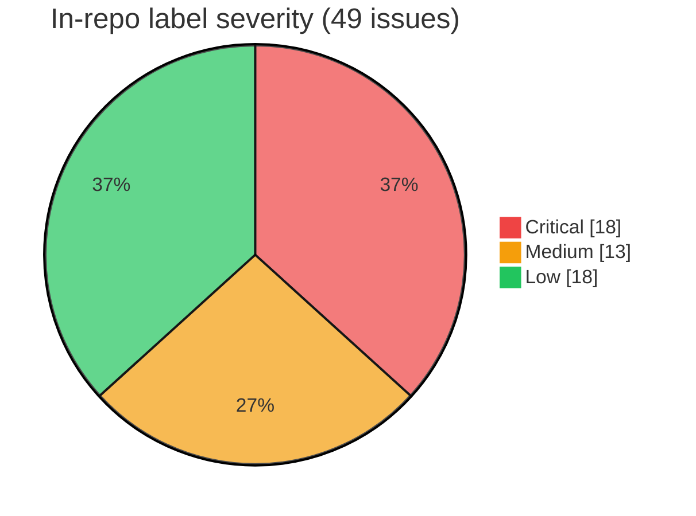

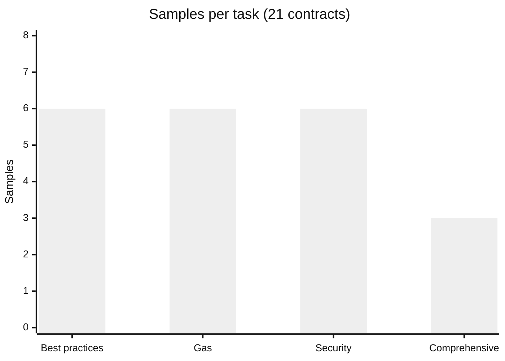

| Signal | Value |
|--------|------:|
| Labeled contracts (OpenEnv) | **21** |
| Labeled issues | **49** |
| Task tiers | **4** |
| GCB train cap (Wild) | **5,000** |
| GCB held-out accuracy | **~56%** |
| GCB held-out macro-F1 | **~0.47** |
| Reward range | **[0.0, 1.0]** |

> **Honest scope:** Graph CodeBERT is a **screening** model on tool-consensus Wild labels — not a human audit replacement. It runs **beside** Slither & patterns; missing weights never crash the API.

---

## Why this wins

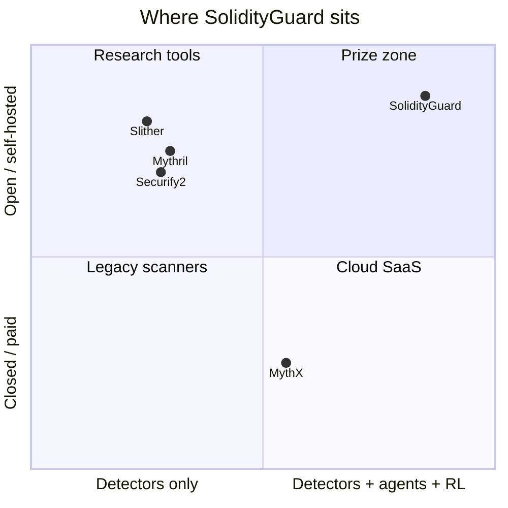

| Market gap | SolidityGuard |
|------------|---------------|
| Static tools = detectors only | Detectors **+** LLM explain / PoC / fix |
| MythX = paid cloud | Self-hosted, **MIT**, Docker / HF Spaces |
| ChatGPT paste = no grader | OpenEnv `reset` / `step` → reward **∈ [0, 1]** |
| No learned first-pass on your stack | Fine-tuned **Graph CodeBERT** in the scanner |

### Feature matrix

| Feature | SolidityGuard | Slither | Mythril | MythX | Securify2 |
|---------|:---:|:---:|:---:|:---:|:---:|
| Multi-agent pipeline | ✅ | ❌ | ❌ | ❌ | ❌ |
| LLM explain / fix | ✅ | ❌ | ❌ | ◐ | ❌ |
| Fine-tuned Graph CodeBERT | ✅ | ❌ | ❌ | ❌ | ❌ |
| Foundry-style PoC drafts | ✅ | ❌ | ❌ | ❌ | ❌ |
| Gas + practices + security | ✅ | ✅ | ◐ | ✅ | ◐ |
| RL / OpenEnv rewards | ✅ | ❌ | ❌ | ❌ | ❌ |
| Self-hosted MIT | ✅ | ✅ | ✅ | ❌ | ✅ |

*◐ = partial*

---

## System map

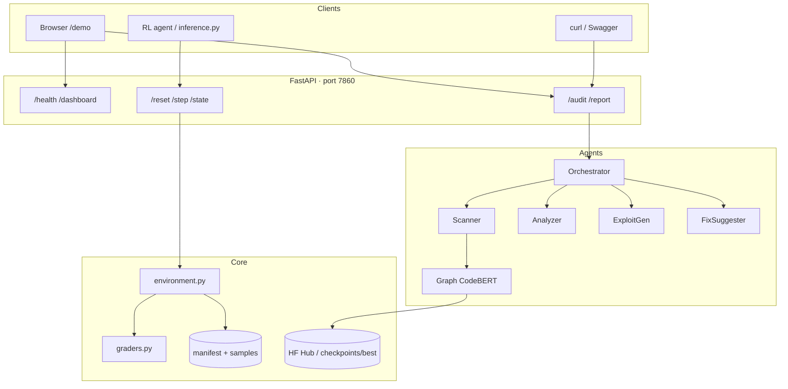

### Audit request lifecycle

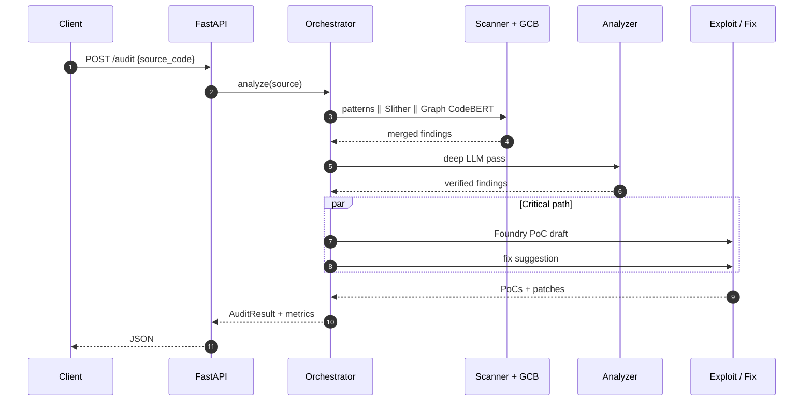

### OpenEnv RL loop

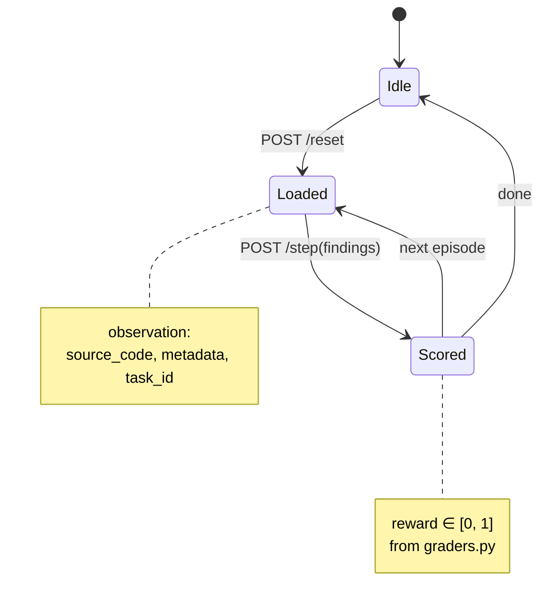

---

## Pipeline (one contract)

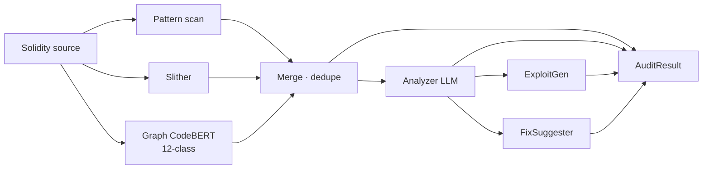

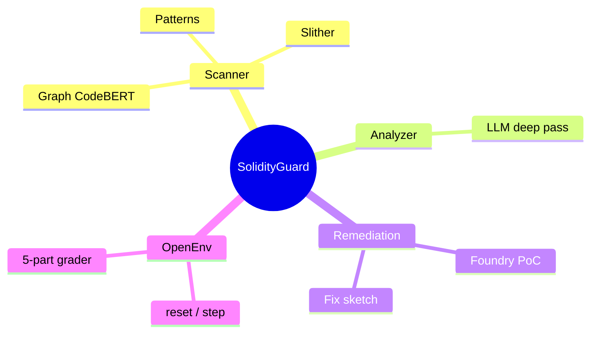

---

## Tasks & dataset

| Task | Difficulty | Focus | n |
|------|:---:|-------|:-:|
| `task_1_best_practices` | Easy | SPDX, NatSpec, pragma, deprecated patterns | 6 |
| `task_2_gas_optimization` | Medium | Loops, storage, packing, custom errors | 6 |
| `task_3_security` | Hard | Reentrancy, access control, `tx.origin`, delegatecall, randomness | 6 |
| `task_4_comprehensive_audit` | Hard | Mixed cross-category | 3 |

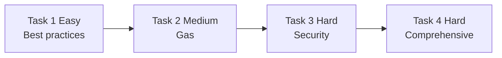

---

## Scoring (RL-stable)

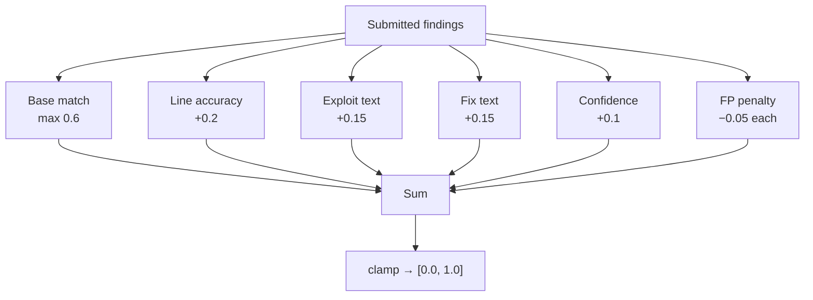

| Component | Cap | Role |
|-----------|:---:|------|
| Base match | 0.6 | Matched / expected |
| Line accuracy | +0.2 | Near-exact lines |
| Exploit text | +0.15 | Attack narrative |
| Fix text | +0.15 | Actionable patch |
| Confidence | +0.1 | Calibrated scores |
| False positive | −0.05 ea. | Extra unmatched |

---

## Graph CodeBERT training

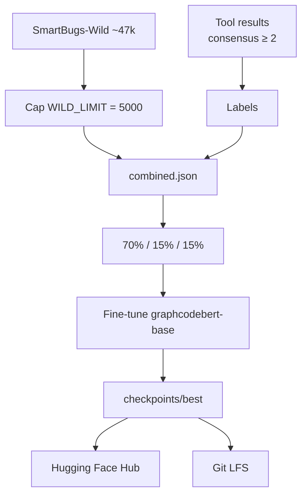

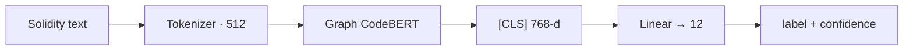

**Classes:** `safe` · `reentrancy` · `access_control` · `tx_origin_auth` · `integer_overflow` · `unsafe_delegatecall` · `weak_randomness` · `unbounded_loop` · `redundant_storage` · `gas_optimization` · `best_practice` · `other`

```bash
bash training/run.sh
# WILD_LIMIT=2000 bash training/run.sh

export GRAPHCODEBERT_PATH=tanaymitra01/graphcodebert-vulnerability-detector
# or: export GRAPHCODEBERT_PATH=training/checkpoints/best
```

---

## Quick start

```bash
git clone https://github.com/tanaymitra54/solidity_guard_razorpay.git
cd solidity_guard_razorpay
python3 -m venv .venv && source .venv/bin/activate
pip install -r requirements.txt
export GRAPHCODEBERT_PATH=tanaymitra01/graphcodebert-vulnerability-detector
uvicorn server.app:app --host 0.0.0.0 --port 7860
```

| URL | What |
|-----|------|
| http://localhost:7860 | Landing |
| http://localhost:7860/demo | Interactive audit |
| http://localhost:7860/docs | Swagger |
| http://localhost:7860/health | GCB + dataset status |

---

## Demo in 60 seconds

```bash
curl -s http://localhost:7860/health | python3 -m json.tool

curl -s -X POST http://localhost:7860/audit \
  -H "Content-Type: application/json" \
  -d '{
    "source_code": "pragma solidity ^0.8.0; contract V { mapping(address=>uint) b; function withdraw() public { uint x=b[msg.sender]; msg.sender.call{value:x}(\"\"); b[msg.sender]=0; } }",
    "generate_exploits": false,
    "generate_fixes": false
  }'
```

Or paste `data/samples/task3/reentrancy.sol` into **`/demo`**. Findings with `"source": "graphcodebert"` mean the neural pass fired (confidence ≥ threshold, default `0.5`).

---

## API

| Method | Path | Role |
|--------|------|------|
| GET | `/` | Landing |
| GET | `/demo` | Live audit UI |
| GET | `/health` | Uptime · dataset · GCB |
| GET | `/dashboard` | Analytics |
| GET | `/state` | Env state |
| POST | `/reset` | OpenEnv episode |
| POST | `/step` | Findings → reward |
| POST | `/audit` | Full pipeline |
| POST | `/report` | Rich report |
| GET | `/docs` | OpenAPI |

---

## Environment

| Variable | Need | Meaning |
|----------|:---:|---------|
| `GRAPHCODEBERT_PATH` | Optional | Hub id or local checkpoint |
| `GRAPHCODEBERT_THRESHOLD` | Optional | Default `0.5` |
| `API_BASE_URL` · `MODEL_NAME` · `HF_TOKEN` | LLM | Agents / inference |
| `LLM_BASE_URL` · `LLM_API_KEY` | Optional | Overrides |
| `WILD_LIMIT` | Training | Default `5000` |

---

## Repo layout

```
solidity_guard_razorpay/
├── server/app.py                 # FastAPI :7860
├── agents/                       # orchestrator · scanner · graphcodebert · …
├── training/                     # run.sh · download · train · checkpoints/best
├── environment.py · graders.py · inference.py · openenv.yaml
├── data/manifest.json · samples/task{1,2,3,4}/
└── Dockerfile
```

---

## Deploy

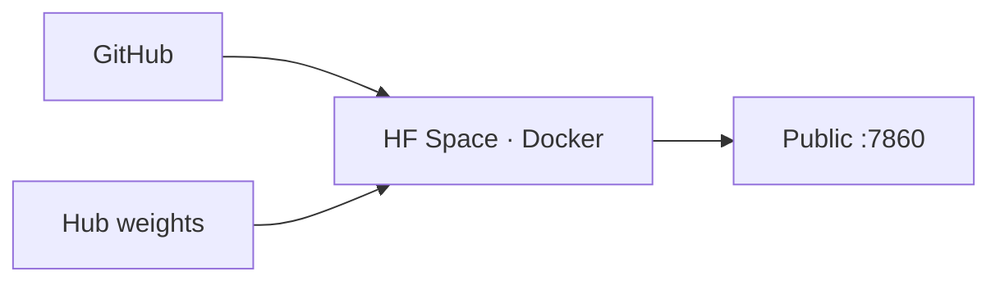

1. Create Space with `sdk: docker`  
2. Link this repo  
3. Set `GRAPHCODEBERT_PATH` (+ LLM secrets if needed)  
4. Serve on **7860**

---

## Notes

- `inference.py` targets **&lt; 20 min** on modest CPU with `[START]` / `[STEP]` / `[END]`  
- `multi_agent.py` works **without** an LLM  
- Wild labels = tool consensus → GCB is for **screening**  
- Caches gitignored; weights on **Git LFS** + **Hugging Face**

---

## Citation

```bibtex
@misc{solidityguard2026,
  title  = {SolidityGuard: OpenEnv RL Environment for Smart Contract Security Review},
  author = {Tanay Mitra},
  year   = {2026},
  url    = {https://github.com/tanaymitra54/solidity_guard_razorpay}
}
```

<div align="center">

**SolidityGuard** · MIT · Built by [Tanay Mitra](https://github.com/tanaymitra54)

</div>
