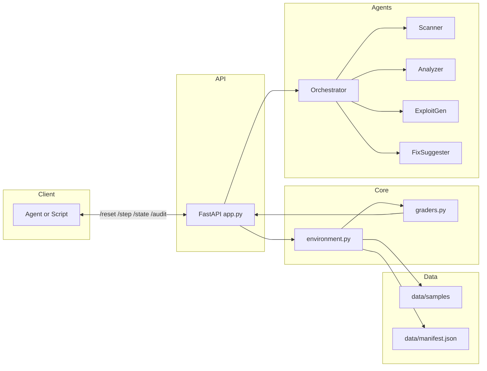

# SolidityGuard

SolidityGuard is an OpenEnv RL environment that trains AI agents to review Solidity smart contracts for security vulnerabilities, gas optimizations, and best practices. It provides a multi-agent audit pipeline, structured reward scoring, and a dataset of real-world Solidity samples.

## Architecture



## What the project does

- **Multi-Agent Pipeline**: Scanner (pattern matching + Slither) → Analyzer (LLM deep analysis) → ExploitGen (Foundry PoC exploits) → FixSuggester (targeted patches)
- **4 Difficulty Tiers**: Best practices (easy) → Gas optimization (medium) → Security (hard) → Comprehensive audit (hard)
- **Advanced Scoring**: 5-component reward function (base match, line accuracy, exploit explanation, fix quality, confidence calibration)
- **21 Real-World Samples**: Solidity contracts covering 15+ vulnerability types across 4 tiers
- **Structured Logging**: JSON-formatted logs with request IDs for full pipeline traceability

## Competitive Comparison

| Feature | SolidityGuard | Slither | Mythril | MythX | Securify2 |
|---------|:---:|:---:|:---:|:---:|:---:|
| **Multi-Agent Architecture** | ✅ | ❌ | ❌ | ❌ | ❌ |
| **LLM-Powered Analysis** | ✅ | ❌ | ❌ | ✅ | ❌ |
| **Auto-Generated Exploit PoCs** | ✅ Foundry tests | ❌ | ❌ | ❌ | ❌ |
| **Auto-Fix Suggestions** | ✅ | ❌ | ❌ | ❌ | ❌ |
| **Gas Optimization Detection** | ✅ | ✅ | ✅ | ✅ | ❌ |
| **Security Vulnerability Detection** | ✅ | ✅ | ✅ | ✅ | ✅ |
| **Best Practices Detection** | ✅ | ✅ | ❌ | ✅ | ❌ |
| **RL Training Environment** | ✅ | ❌ | ❌ | ❌ | ❌ |
| **OpenEnv Spec Compliant** | ✅ | ❌ | ❌ | ❌ | ❌ |
| **Self-Hosted / No API Cost** | ✅ | ✅ | ✅ | ❌ | ✅ |
| **Open Source** | ✅ MIT | ✅ | ✅ | ❌ | ✅ |
| **Audit Cost** | Free | Free | Free | $50-500/mo | Free |

## Task Taxonomy

| Task | Difficulty | Focus | Samples | Issue Types |
|------|:---:|-------|:---:|-------------|
| Task 1 | Easy | Best Practices & Syntax | 6 | SPDX, NatSpec, compiler version, deprecated patterns |
| Task 2 | Medium | Gas Optimization | 6 | Unbounded loops, storage reads, struct packing, custom errors |
| Task 3 | Hard | Security Vulnerabilities | 6 | Reentrancy, access control, tx.origin, delegatecall, randomness |
| Task 4 | Hard | Comprehensive Audit | 3 | Cross-category: combines best practices + gas + security issues |

## Dataset Statistics

```
Total Samples:  21
Total Issues:   49
Severity Distribution:
  Critical:     18 (36.7%)
  Medium:       13 (26.5%)
  Low:          18 (36.7%)

Task Breakdown:
  task_1_best_practices:    6 samples, 14 issues
  task_2_gas_optimization:  6 samples,  9 issues
  task_3_security:          6 samples,  9 issues
  task_4_comprehensive:     3 samples, 17 issues
```

## Quick Start

### Requirements
- Python 3.11+
- `API_BASE_URL`, `MODEL_NAME`, `HF_TOKEN` environment variables (for LLM inference)

### Install
```bash
pip install -r requirements.txt
```

### Run API Server
```bash
uvicorn server.app:app --host 0.0.0.0 --port 7860
```

### Run Inference
```bash
python inference.py
```

### Run Multi-Agent Audit (No LLM Required)
```python
from multi_agent import MultiAgentSystem

system = MultiAgentSystem()
source = open("data/samples/task3/reentrancy.sol").read()
findings = system.process(source, "task_3_security")
for f in findings:
    print(f"{f['issue_type']} (risk={f['risk_score']})")
```

## API Endpoints

| Method | Endpoint | Description |
|--------|----------|-------------|
| GET | `/health` | System health with uptime and dataset info |
| POST | `/reset` | Initialize environment with a task |
| POST | `/step` | Submit findings and receive score |
| GET | `/state` | Get current environment state |
| POST | `/report` | Generate comprehensive audit report |
| POST | `/audit` | Run full multi-agent pipeline on a contract |
| GET | `/dashboard` | Real-time analytics (computed from dataset) |
| GET | `/` | Cyberpunk landing page |
| GET | `/demo` | Interactive live demo |

## Scoring System

The 5-component reward function:

| Component | Weight | Max Bonus | Description |
|-----------|:---:|:---:|-------------|
| Base Score | 60% | 0.6 | Matched findings / expected findings |
| Line Accuracy | — | +0.2 | Bonus for exact or near-exact line numbers |
| Exploit Explanation | — | +0.15 | Bonus for detailed attack scenarios (50+ chars) |
| Fix Suggestion | — | +0.15 | Bonus for actionable fix recommendations (20+ chars) |
| Confidence Calibration | — | +0.1 | Bonus for appropriate confidence levels |
| False Positive Penalty | — | -0.05 each | Deduction for each unmatched finding |

All scores are clamped to [0.0, 1.0] for stable RL reward signals.

## Structured Logging

All agents emit JSON-formatted logs with request tracing:

```json
{"event": "pipeline_start", "request_id": "a1b2c3d4e5f6", "task_id": "task_3_security", "source_lines": 42}
{"event": "scanner_start", "source_lines": 42}
{"event": "llm_call_success", "model": "Qwen/Qwen2.5-72B-Instruct", "attempt": 1, "tokens": 512}
{"event": "pipeline_done", "request_id": "a1b2c3d4e5f6", "total_findings": 3, "critical": 1, "elapsed": 4.2}
```

## File Structure

```
ContractSLM/
├── server/
│   └── app.py              # FastAPI endpoints (health, reset, step, audit, dashboard)
├── agents/
│   ├── base.py             # BaseAgent, Finding, LLMClient, structured logging
│   ├── orchestrator.py     # Multi-agent pipeline coordinator
│   ├── scanner.py          # Pattern matching + Slither + LLM scanning
│   ├── analyzer.py         # Deep LLM-powered analysis
│   ├── exploit_gen.py      # Foundry PoC exploit generation
│   ├── fix_suggester.py    # Targeted fix generation
│   └── __init__.py
├── environment.py          # OpenEnv core (reset/step/state)
├── graders.py              # 5-component reward scoring
├── multi_agent.py          # Static multi-agent system (no LLM)
├── inference.py            # LLM inference with [START]/[STEP]/[END] logging
├── openenv.yaml            # OpenEnv spec
├── requirements.txt        # Dependencies
├── Dockerfile              # Container config
├── data/
│   ├── manifest.json       # 21 samples with labels
│   └── samples/
│       ├── task1/          # 6 best practices contracts
│       ├── task2/          # 6 gas optimization contracts
│       ├── task3/          # 6 security vulnerability contracts
│       └── task4/          # 3 comprehensive audit contracts
└── README.md
```

## Environment Variables

| Variable | Required | Description |
|----------|:---:|-------------|
| `API_BASE_URL` | For LLM | LLM API endpoint (default: HF router) |
| `MODEL_NAME` | For LLM | Model identifier (default: Qwen2.5-72B) |
| `HF_TOKEN` | For LLM | Hugging Face API key |
| `LLM_BASE_URL` | Optional | Override LLM endpoint for agents |
| `LLM_API_KEY` | Optional | Override API key for agents |

## Deployment

### Hugging Face Spaces
1. Create a Space with `sdk: docker`
2. Link to this GitHub repo
3. Set environment variables in Space Settings
4. The server starts on port 7860 automatically

### Local Development
```bash
pip install -r requirements.txt
uvicorn server.app:app --host 0.0.0.0 --port 7860
```

## Notes

- Runtime: ~150s (target: <20 minutes on 2 vCPU / 8 GB)
- All scores are clamped to [0.0, 1.0] for RL stability
- The multi-agent system works without LLM (static analysis mode)
- Dashboard data is computed in real-time from the dataset (no hardcoded metrics)
