# SolidityGuard

**OpenEnv RL environment + multi-agent auditor for Solidity smart contracts.**

SolidityGuard trains and evaluates AI agents that review Solidity for security vulnerabilities, gas optimizations, and best practices. It combines static analysis (Slither / patterns), a fine-tuned **Graph CodeBERT** classifier, and LLM agents that propose exploits and fixes — all behind an OpenEnv-compatible API with structured rewards.

| Resource | Link |
|----------|------|
| **GitHub** | [tanaymitra54/solidity_guard_razorpay](https://github.com/tanaymitra54/solidity_guard_razorpay) |
| **Fine-tuned model (HF)** | [`tanaymitra01/graphcodebert-vulnerability-detector`](https://huggingface.co/tanaymitra01/graphcodebert-vulnerability-detector) |
| **Base model** | [`microsoft/graphcodebert-base`](https://huggingface.co/microsoft/graphcodebert-base) |
| **License** | MIT |

---

## Table of contents

- [System architecture](#system-architecture)
- [Audit pipeline](#audit-pipeline)
- [OpenEnv RL loop](#openenv-rl-loop)
- [What the project does](#what-the-project-does)
- [Competitive comparison](#competitive-comparison)
- [Task taxonomy](#task-taxonomy)
- [Dataset](#dataset)
- [Quick start](#quick-start)
- [API endpoints](#api-endpoints)
- [Scoring system](#scoring-system)
- [Graph CodeBERT fine-tuning](#graph-codebert-fine-tuning)
- [Environment variables](#environment-variables)
- [File structure](#file-structure)
- [Deployment](#deployment)
- [Notes](#notes)

---

## System architecture

High-level view of clients, API, OpenEnv core, agents, and data.

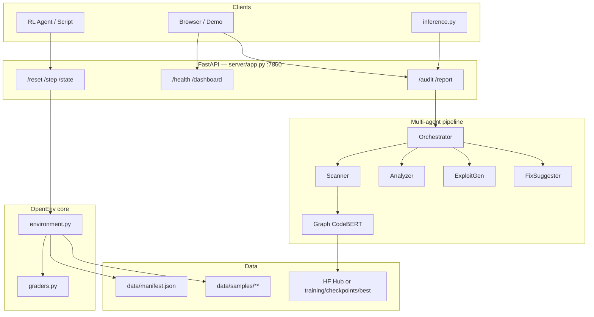

---

## Audit pipeline

How a single contract moves through detectors and LLM agents.

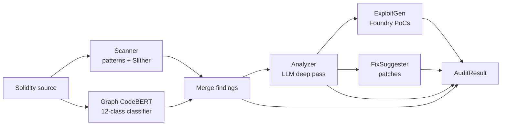

### Sequence (request lifecycle)

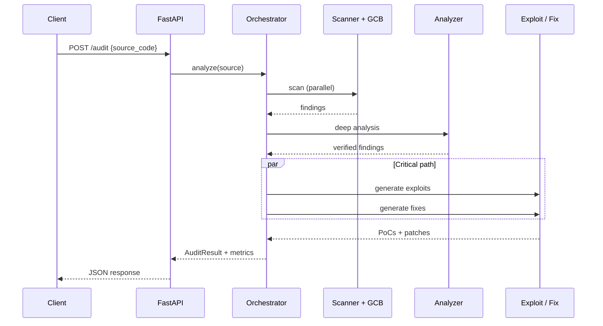

---

## OpenEnv RL loop

Agents interact through reset / step / reward for training and evaluation.

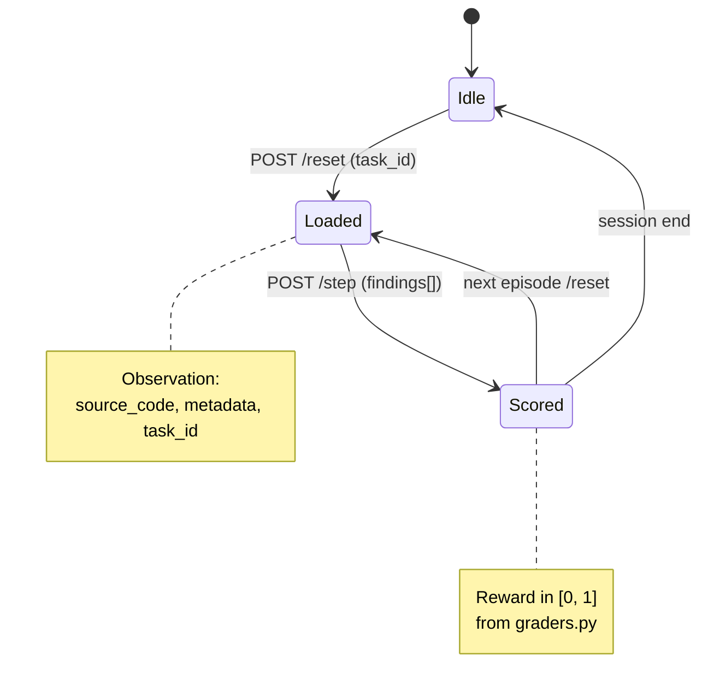

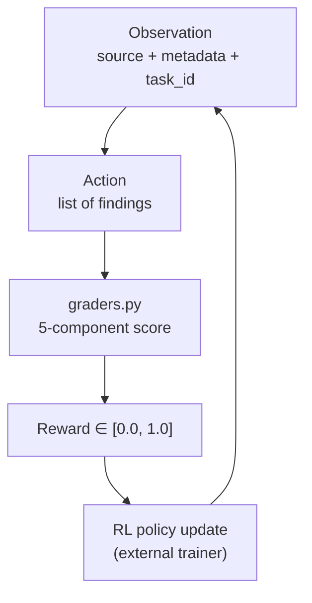

---

## What the project does

- **Multi-agent pipeline** — Scanner (patterns + Slither + Graph CodeBERT) → Analyzer → ExploitGen → FixSuggester  
- **4 difficulty tiers** — Best practices → Gas → Security → Comprehensive audit  
- **Structured rewards** — 5-component grader for stable RL signals  
- **21 labeled samples** — Real Solidity contracts across 15+ issue types  
- **Graph CodeBERT** — Fine-tuned classifier hosted on Hugging Face for first-pass detection  
- **OpenEnv + Docker** — Spec-compliant environment, HF Spaces–ready  
- **Structured JSON logs** — Request IDs across the full pipeline  

---

## Competitive comparison

| Feature | SolidityGuard | Slither | Mythril | MythX | Securify2 |
|---------|:---:|:---:|:---:|:---:|:---:|
| Multi-agent architecture | ✅ | ❌ | ❌ | ❌ | ❌ |
| LLM-powered analysis | ✅ | ❌ | ❌ | ✅ | ❌ |
| Fine-tuned code LM (Graph CodeBERT) | ✅ | ❌ | ❌ | ❌ | ❌ |
| Auto-generated exploit PoCs | ✅ Foundry | ❌ | ❌ | ❌ | ❌ |
| Auto-fix suggestions | ✅ | ❌ | ❌ | ❌ | ❌ |
| Gas optimization detection | ✅ | ✅ | ✅ | ✅ | ❌ |
| Security vulnerability detection | ✅ | ✅ | ✅ | ✅ | ✅ |
| Best-practices detection | ✅ | ✅ | ❌ | ✅ | ❌ |
| RL training environment | ✅ | ❌ | ❌ | ❌ | ❌ |
| OpenEnv spec compliant | ✅ | ❌ | ❌ | ❌ | ❌ |
| Self-hosted / open source | ✅ MIT | ✅ | ✅ | ❌ | ✅ |

---

## Task taxonomy

| Task | Difficulty | Focus | Samples | Issue types |
|------|:---:|-------|:---:|-------------|
| Task 1 | Easy | Best practices & syntax | 6 | SPDX, NatSpec, compiler version, deprecated patterns |
| Task 2 | Medium | Gas optimization | 6 | Unbounded loops, storage reads, packing, custom errors |
| Task 3 | Hard | Security | 6 | Reentrancy, access control, `tx.origin`, delegatecall, randomness |
| Task 4 | Hard | Comprehensive audit | 3 | Cross-category mix |

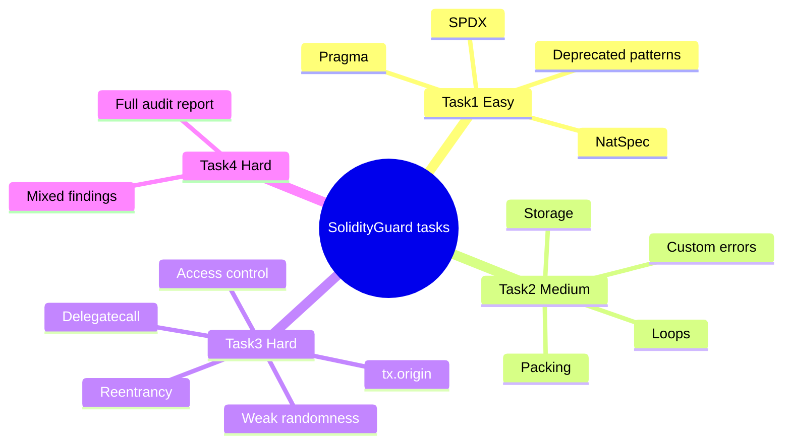

---

## Dataset

### Hackathon / OpenEnv samples (in-repo)

```
Total samples:  21
Total issues:   49
Severity:
  Critical: 18 (36.7%)
  Medium:   13 (26.5%)
  Low:      18 (36.7%)
```

### Graph CodeBERT training data (SmartBugs-Wild)

| Item | Value |
|------|-------|
| Source | SmartBugs-Wild + tool consensus labels |
| Cap (default) | 5,000 contracts (`WILD_LIMIT`) |
| Split | 70% train / 15% val / 15% test |
| Held-out accuracy | ~0.56 |
| Held-out macro-F1 | ~0.47 |

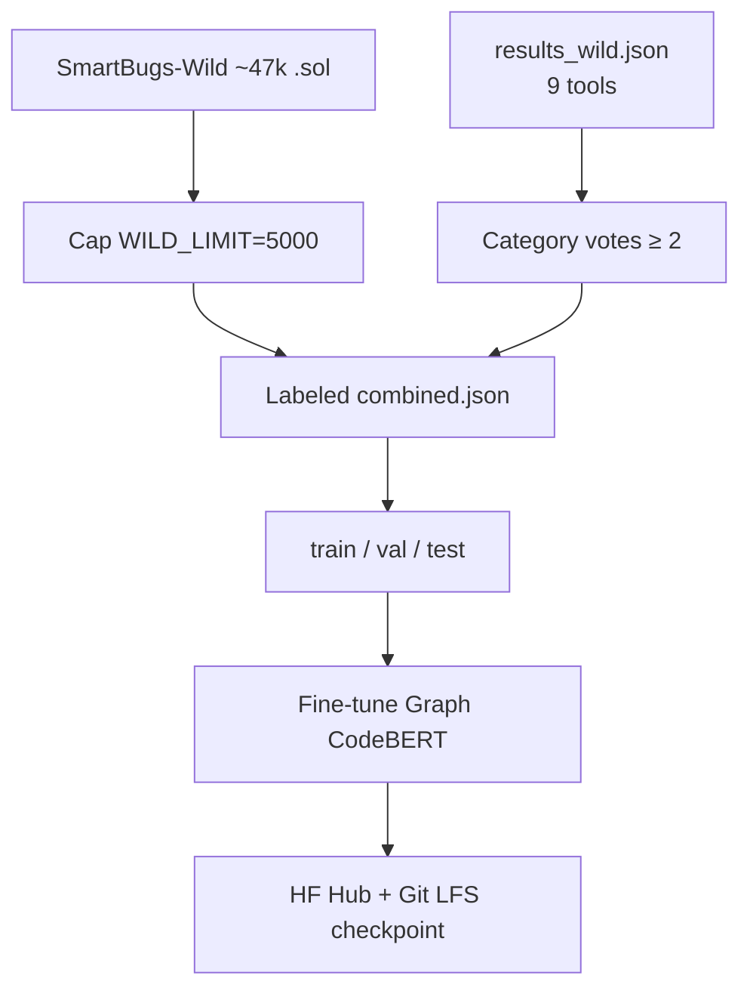

---

## Quick start

### Requirements

- Python 3.11+ (3.12 OK with a venv)
- Optional GPU for training / faster GCB inference  
- For LLM features: `API_BASE_URL`, `MODEL_NAME`, `HF_TOKEN`

### Install

```bash
git clone https://github.com/tanaymitra54/solidity_guard_razorpay.git
cd solidity_guard_razorpay
python3 -m venv .venv && source .venv/bin/activate
pip install -r requirements.txt
```

### Run API server

```bash
export GRAPHCODEBERT_PATH=tanaymitra01/graphcodebert-vulnerability-detector
uvicorn server.app:app --host 0.0.0.0 --port 7860
```

Open `http://localhost:7860` (landing) or `/demo`.

### Run inference script

```bash
python inference.py
```

### Multi-agent audit without LLM

```python
from multi_agent import MultiAgentSystem

system = MultiAgentSystem()
source = open("data/samples/task3/reentrancy.sol").read()
findings = system.process(source, "task_3_security")
for f in findings:
    print(f"{f['issue_type']} (risk={f['risk_score']})")
```

### Load Graph CodeBERT from the Hub

```python
from transformers import AutoTokenizer, AutoModelForSequenceClassification
import torch

repo = "tanaymitra01/graphcodebert-vulnerability-detector"
tok = AutoTokenizer.from_pretrained(repo)
model = AutoModelForSequenceClassification.from_pretrained(repo)
model.eval()
```

---

## API endpoints

| Method | Endpoint | Description |
|--------|----------|-------------|
| GET | `/` | Landing page |
| GET | `/demo` | Interactive demo |
| GET | `/health` | Health, uptime, dataset info |
| GET | `/dashboard` | Analytics from dataset |
| GET | `/state` | Current environment state |
| POST | `/reset` | Start episode with a task |
| POST | `/step` | Submit findings → reward |
| POST | `/audit` | Full multi-agent pipeline |
| POST | `/report` | Comprehensive audit report |

---

## Scoring system

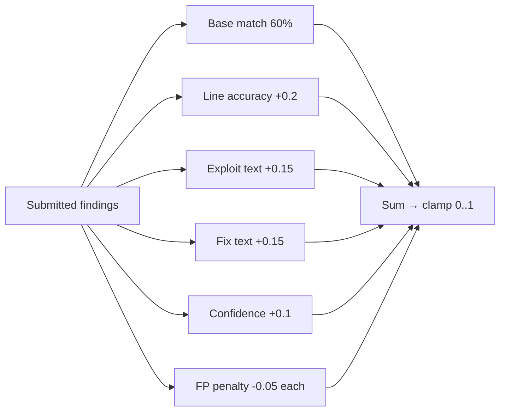

| Component | Weight / bonus | Description |
|-----------|:---:|-------------|
| Base score | 60% (max 0.6) | Matched / expected findings |
| Line accuracy | +0.2 | Exact or near-exact lines |
| Exploit explanation | +0.15 | Detailed attack scenario |
| Fix suggestion | +0.15 | Actionable patch text |
| Confidence calibration | +0.1 | Sensible confidence values |
| False-positive penalty | −0.05 each | Unmatched extras |

All rewards are clamped to **[0.0, 1.0]** for stable RL.

---

## Structured logging

```json
{"event": "pipeline_start", "request_id": "a1b2c3d4e5f6", "task_id": "task_3_security", "source_lines": 42}
{"event": "scanner_start", "source_lines": 42}
{"event": "llm_call_success", "model": "Qwen/Qwen2.5-72B-Instruct", "attempt": 1, "tokens": 512}
{"event": "pipeline_done", "request_id": "a1b2c3d4e5f6", "total_findings": 3, "critical": 1, "elapsed": 4.2}
```

---

## Graph CodeBERT fine-tuning

### One-command train (GPU recommended)

```bash
bash training/run.sh
# optional: WILD_LIMIT=1000 bash training/run.sh
```

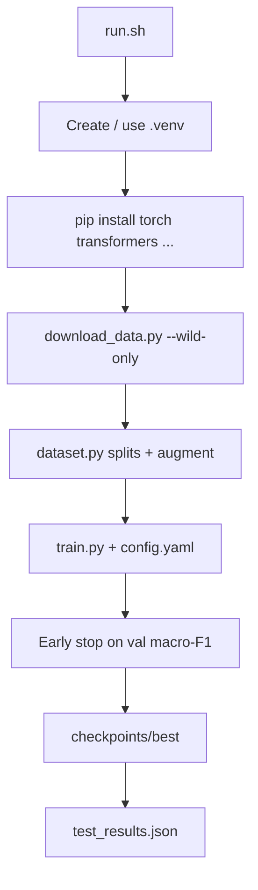

### Model head

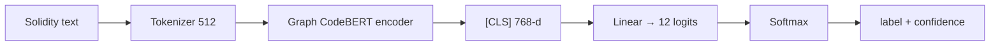

**Classes:** `safe`, `reentrancy`, `access_control`, `tx_origin_auth`, `integer_overflow`, `unsafe_delegatecall`, `weak_randomness`, `unbounded_loop`, `redundant_storage`, `gas_optimization`, `best_practice`, `other`

### Use the published checkpoint

```bash
# Hugging Face (anywhere)
export GRAPHCODEBERT_PATH=tanaymitra01/graphcodebert-vulnerability-detector

# Or local / Git LFS checkout
export GRAPHCODEBERT_PATH=training/checkpoints/best
```

### Manual steps

```bash
python training/download_data.py --output training/data --wild-only --wild-limit 5000
python training/dataset.py --combined training/data/combined.json --augment --output training/cache
python training/train.py --config training/config.yaml
python training/evaluate.py --model training/checkpoints/best --split test
```

### Training config (`training/config.yaml`)

| Parameter | Default | Description |
|-----------|---------|-------------|
| `model_name` | `microsoft/graphcodebert-base` | Base HF model |
| `epochs` | 20 | Max epochs (early stopping) |
| `batch_size` | 32 | H100-friendly default |
| `learning_rate` | `2e-5` | AdamW |
| `max_length` | 512 | Token limit |
| `early_stopping_patience` | 5 | Stop if val F1 stalls |

### Checkpoint layout

```
training/checkpoints/
├── best/                 # Best by val macro-F1 (also on HF + Git LFS)
│   ├── config.json
│   ├── model.safetensors
│   ├── label_map.json
│   └── README.md
└── test_results.json
```

---

## Environment variables

| Variable | Required | Description |
|----------|:---:|-------------|
| `API_BASE_URL` | For LLM | LLM API endpoint |
| `MODEL_NAME` | For LLM | Model id (e.g. Qwen2.5-72B) |
| `HF_TOKEN` | For LLM / private Hub | Hugging Face token |
| `LLM_BASE_URL` | Optional | Override agent LLM endpoint |
| `LLM_API_KEY` | Optional | Override agent API key |
| `GRAPHCODEBERT_PATH` | Optional | Local dir **or** Hub id (`tanaymitra01/graphcodebert-vulnerability-detector`) |
| `GRAPHCODEBERT_THRESHOLD` | Optional | Min confidence to emit a finding (default `0.5`) |
| `WILD_LIMIT` | Optional | Cap wild samples for training (default `5000`) |

---

## File structure

```
solidity_guard_razorpay/
├── server/app.py                 # FastAPI: health, reset, step, audit, dashboard
├── agents/
│   ├── orchestrator.py           # Pipeline coordinator
│   ├── scanner.py                # Patterns + Slither + LLM
│   ├── graphcodebert.py          # Fine-tuned classifier (local or Hub)
│   ├── analyzer.py
│   ├── exploit_gen.py
│   ├── fix_suggester.py
│   └── base.py                   # Finding, LLMClient, logging
├── training/
│   ├── run.sh                    # One-shot fine-tune
│   ├── download_data.py          # SmartBugs download + parse
│   ├── dataset.py
│   ├── train.py
│   ├── evaluate.py
│   ├── config.yaml
│   └── checkpoints/best/         # Published weights (Git LFS)
├── environment.py                # OpenEnv reset / step / state
├── graders.py                    # 5-component reward
├── multi_agent.py                # Static pipeline (no LLM)
├── inference.py                  # [START]/[STEP]/[END] logging
├── openenv.yaml
├── Dockerfile
├── data/
│   ├── manifest.json
│   └── samples/task{1,2,3,4}/
└── README.md
```

---

## Deployment

### Hugging Face Spaces (Docker)

1. Create a Space with `sdk: docker`  
2. Connect this GitHub repo  
3. Set `GRAPHCODEBERT_PATH`, and LLM env vars if needed  
4. Space serves on port **7860**

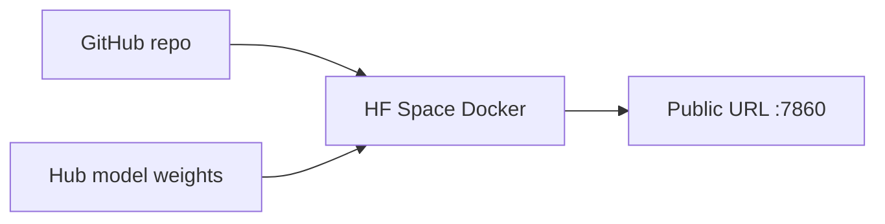

### Local

```bash
pip install -r requirements.txt
export GRAPHCODEBERT_PATH=tanaymitra01/graphcodebert-vulnerability-detector
uvicorn server.app:app --host 0.0.0.0 --port 7860
```

---

## Notes

- Inference script target: complete under **20 minutes** on modest CPU  
- Rewards always clamped to `[0.0, 1.0]`  
- Multi-agent static path works **without** an LLM  
- Graph CodeBERT labels come from tool consensus — useful for screening, not a full audit replacement  
- Large training caches (`training/data/`, `.venv/`) are gitignored; weights live on **Git LFS** and **Hugging Face**

---

## Citation

```bibtex
@misc{solidityguard2026,
  title  = {SolidityGuard: OpenEnv RL Environment for Smart Contract Security Review},
  author = {Tanay Mitra},
  year   = {2026},
  url    = {https://github.com/tanaymitra54/solidity_guard_razorpay}
}
```
